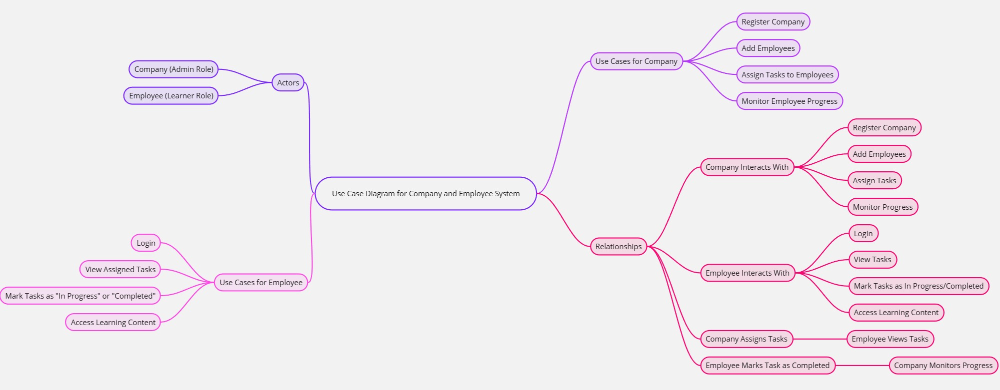
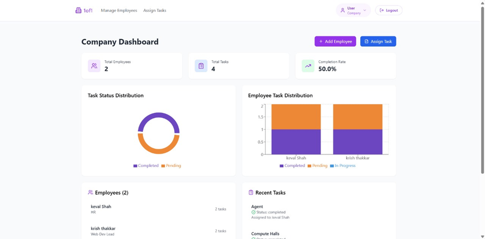
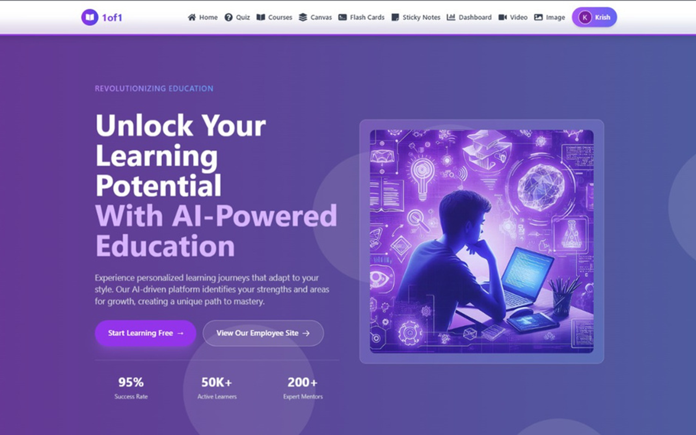
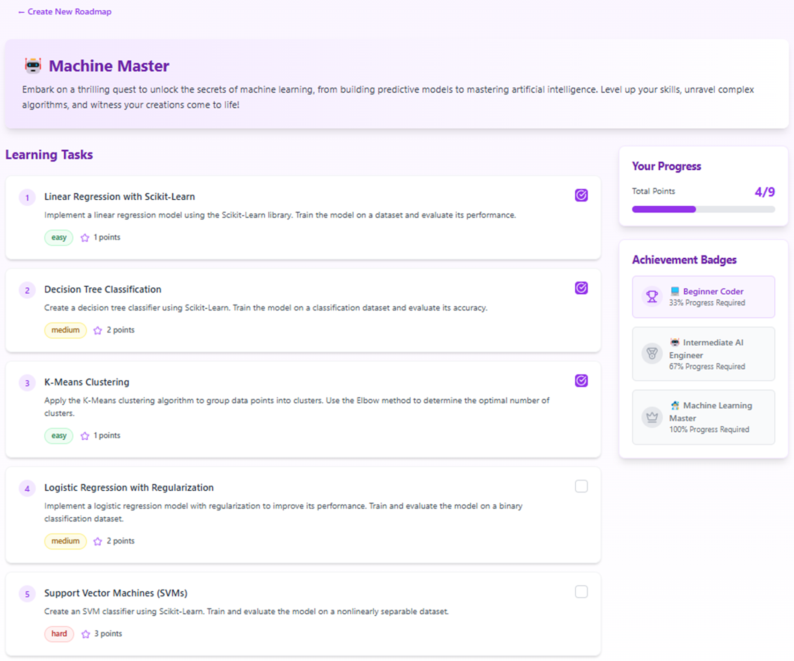
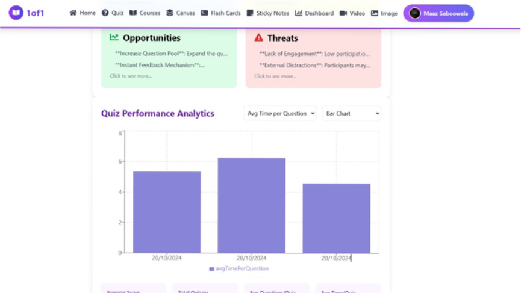
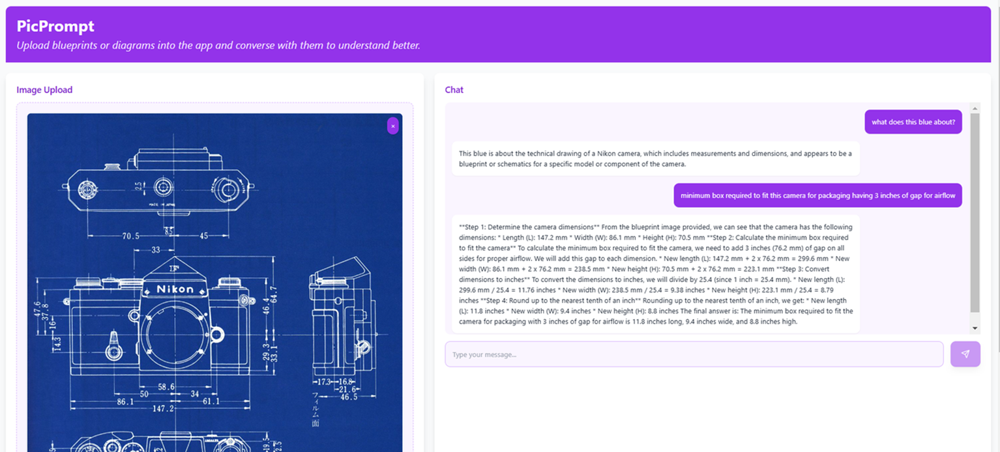

# 1of1: Gamified Learning Platform 🚀

**Welcome to 1of1** — a revolutionary platform that blends **gamification** with **AI-powered learning** to create a highly interactive, personalized, and engaging learning experience for employees. Gone are the days of monotonous training sessions! With **1of1**, learning becomes a game—rewarding, motivating, and fun.

## 📅 **Presentation**

For an in-depth look at **1of1** and how it transforms learning into a gamified experience, check out our presentation here:

[View the Presentation on Canva](https://www.canva.com/design/DAGb0YrZUB4/9_zj1-KihmmIDvxuGf2MCA/view?utm_content=DAGb0YrZUB4&utm_campaign=designshare&utm_medium=link2&utm_source=uniquelinks&utlId=h824f204a54)

---

## 🚀 **Use Case Diagram**

Here’s a visual representation of the **1of1** system architecture, showcasing how **Company** and **Employee** users interact with the platform, as well as the core processes involved.

  
*The system's data flow and user interactions with key functionalities.*

---

## 💡 **Unique Features of 1of1**

1. **Personalized Roadmap with Gamification**  
   Employees are assigned a **customized learning journey** that adapts to their strengths and areas of growth. Each milestone is gamified, giving them a sense of accomplishment with **rewards**, **badges**, and **leaderboards**. It’s a learning journey that feels like a game!

2. **AI-Powered Adaptive Quizzes**  
   Our **adaptive quizzes** adjust based on previous responses, ensuring the right level of challenge. Employees are constantly motivated to **level up** their knowledge, earning rewards for improved performance.

3. **Agentic RAG System**  
   We’ve elevated the classic **Red, Amber, Green (RAG)** status system by integrating **Agentic AI**, which provides dynamic feedback and personalized recommendations. This ensures that progress tracking is more precise, fostering better motivation and engagement.

4. **Blueprint Reader**  
   Employees can **interact with blueprints, diagrams, and visual data** directly. This feature allows users to better understand complex materials through engaging interactions, improving comprehension and decision-making.

5. **SWOT Analysis Dashboard**  
   Employees gain insights into their **Strengths, Weaknesses, Opportunities, and Threats (SWOT)**. This personalized data ensures employees focus on areas that truly matter, enhancing both skill development and task performance.

6. **Interactive Task Management for Companies**  
   Companies can **register, onboard employees, assign tasks**, and monitor progress using an interactive **dashboard**. Tasks are gamified, giving employees incentives to complete them on time, while companies can track performance with ease.

---

## 🎮 **Gamification Features**

1. **Badges & Rewards**  
   Just like in a video game, employees earn **badges** and **rewards** upon completing tasks, leveling up in quizzes, and achieving milestones. This keeps them motivated and engaged, driving continuous learning.

2. **Leaderboards**  
   Friendly competition goes a long way in gamified learning. Employees can see their progress compared to peers through **leaderboards**, sparking healthy competition and encouraging them to improve.

3. **Challenges & Milestones**  
   Employees are constantly presented with new **challenges** and **milestones**, ensuring that their learning journey is always exciting and fresh. Every achievement is celebrated with notifications and rewards, just like in a game.

4. **Progress Tracking**  
   Just like in your favorite games, you can track your **learning progress** as you go. Each completed task, quiz, and milestone builds toward a bigger goal, making the process feel like a game with a rewarding end.

---

## 🖼️ **Visuals**

Here are some visuals that highlight key components of the platform:

  
*The **Company Dashboard** for managing tasks and tracking employee progress.*

  
*The **Home Page** where employees can access their personalized learning content.*

  
*The **Personalized Roadmap**, showing the progression and learning path of an employee.*

  
*The **SWOT Analysis** tool helps employees track their strengths and areas for improvement.*

  
*The **Blueprint Reader** enables employees to interact with complex diagrams and visuals.*

---

## 📈 **How It Works**

### **For Companies:**
1. **Register** and add employees.
2. **Assign tasks** and deadlines.
3. **Monitor progress** using an interactive dashboard with real-time updates.

### **For Employees:**
1. **Login** to access assigned tasks and learning content.
2. **Mark tasks** as "In Progress" or "Completed".
3. **Engage with gamified content**, earn rewards, and track progress toward personal and professional growth.

---

## 🔧 **Tech Stack**

- **Frontend**: React, Tailwind CSS, Vite  
- **Backend**: Node.js, Express, MongoDB  
- **AI & Machine Learning**: Agentic AI-based RAG, SWOT analysis  
- **Libraries & Tools**: Flask, Firebase, Gemini, Llama, OpenCV  
- **Version Control**: Git, GitHub

---

